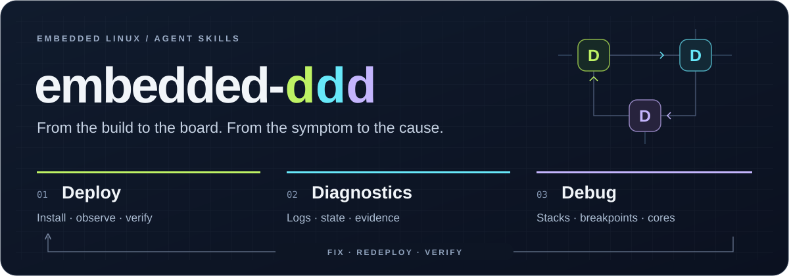

<p align="center">
  
</p>

<p align="center">
  <strong>Deploy · Diagnostics · Debug</strong><br>
  从部署到诊断、调试，让 AI 参与完整的嵌入式 Linux 开发过程。
</p>

<p align="center">
  <a href="README.md">English</a> ·
  <a href="#快速开始">快速开始</a> ·
  <a href="#ddd-的工作方式">DDD 的工作方式</a> ·
  <a href="INSTALL.md">安装说明</a> ·
  <a href="LICENSE">MIT 许可证</a>
</p>

**embedded-ddd** 为 Codex 提供三项相互衔接的嵌入式开发技能。告诉 AI 设备地址和要完成的任务，它会通过 SSH、Telnet 或串口，结合项目已有工具完成部署、定位故障，并检查程序运行状态。

## DDD 的工作方式

DDD 表示 **Deploy（部署）、Diagnostics（诊断）、Debug（调试）**。部署时开始观察，用日志和状态缩小问题范围，再针对具体疑点进入调试，最后回到设备验证修复结果。可以从当前任务需要的任何一步开始。

| 阶段 | 解决的问题 | 技能 |
| --- | --- | --- |
| **Deploy · 部署** | 调用已有安装工具，采集部署前后的日志，核对实际运行的程序 | [embedded-linux-deploy](skills/embedded-linux-deploy/SKILL.md) |
| **Diagnostics · 诊断** | 结合串口、应用、内核日志和进程状态，找出异常发生的位置与条件 | [embedded-linux-diagnostics](skills/embedded-linux-diagnostics/SKILL.md) |
| **Debug · 调试** | 用 GDB 检查线程栈、断点、程序状态或 core 文件，并确认在线调试后的恢复 | [embedded-linux-debug](skills/embedded-linux-debug/SKILL.md) |

三项技能在同一任务中接续使用设备信息和已有证据。串口日志缺失时，继续查找其他可用日志；部署连接中断时，先核对设备实际状态；结束在线调试时，确认进程已经恢复。

## 快速开始

将下面这段话发给 Codex：

```text
请从 https://github.com/srymaker0/embedded_ddd 安装 embedded-ddd，
按照仓库中的 INSTALL.md，为 Codex 完成安装。
```

默认安装到当前用户的技能目录，供多个项目使用。只想在当前项目使用时，加上“仅为当前项目安装”。手动安装、更新和卸载方法见 [INSTALL.md](INSTALL.md)。

随后在正在开发的应用项目中直接描述任务：

```text
把这次构建部署到 192.0.2.10，并检查启动日志。
```

```text
应用一直重启，帮我结合串口日志和板端日志定位原因。
```

```text
用 GDB 看一下哪些线程卡住了，查看完后解除附加，并确认进程恢复运行。
```

Codex 可以根据任务自动选择技能，也可以通过 `$embedded-linux-deploy`、`$embedded-linux-diagnostics` 或 `$embedded-linux-debug` 显式调用。

## 接入现有开发环境

继续使用已有的 SSH 别名、密钥、终端日志和部署脚本。设备信息可以来自对话、项目配置或私有的[连接配置](examples/)。

当前覆盖 **嵌入式 Linux**。调试支持板端 GDB、开发机 GDB 配合 gdbserver，以及离线 core 分析。在线调试会暂停所选进程。目前尚未覆盖 RTOS 和裸机。

### 可选命令行工具

技能可以使用开发环境中已有的工具。项目也提供 `embedded-ddd` 辅助工具，在 Linux 开发机上执行连接、传输、日志采集、部署观察和板端 GDB 快照，见[安装方法](INSTALL.md#command-line-tool)。

选择 [SSH](examples/ssh.json)、[Telnet](examples/telnet.json) 或[串口](examples/serial.json)配置示例，复制到私有路径并替换占位信息，然后执行：

```sh
bin/embedded-ddd --profile /path/to/board.json inspect
bin/embedded-ddd --profile /path/to/board.json collect --output output/logs-001 --duration 30
bin/embedded-ddd --profile /path/to/board.json deploy --output output/deploy-001
bin/embedded-ddd --profile /path/to/board.json gdb-snapshot --pid 1234 --output output/debug-001
```

每次运行使用新的输出目录。配置可以执行其中指定的命令，应使用可信的本机配置。凭据通过 SSH 配置或单独的私有密码文件保存，分享日志前先移除私人信息。

命令连接和文件传输分别配置，文件传输支持 SFTP、SCP、SSH 文件流和 HTTP 上传，并校验 SHA256。部署沿用项目安装工具已有的升级与回滚行为。远程 GDB 和 core 分析由技能指导使用标准调试工具。

## 开发与贡献

安装辅助工具后运行主机测试：

```sh
.venv/bin/python -m unittest discover -s tests -v
```

完整测试需要 GCC、GDB、OpenSSH 客户端与服务端、Telnet 客户端和 curl；缺少可选工具时会显示跳过。测试覆盖连接、传输、日志连续性、部署生命周期、调试后的恢复和技能安装。[评估场景](evals/scenarios.json)可用于进一步检查 AI 的决策行为。

欢迎通过 [GitHub Issues](https://github.com/srymaker0/embedded_ddd/issues) 和 pull request 反馈问题或贡献改进。反馈时请提供开发机与设备环境、复现步骤，以及移除私人信息后的相关日志。

## 许可证

[MIT](LICENSE)。
